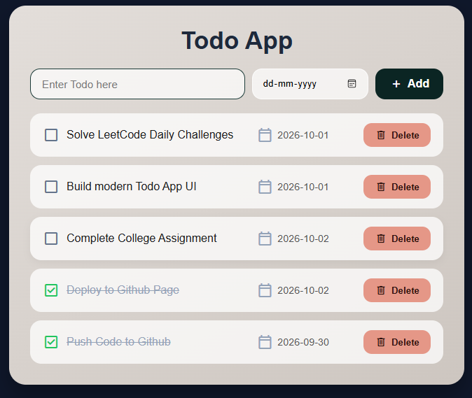

# 📝 Interactive Todo App

A modern, responsive Todo Application built with HTML5, CSS3, JavaScript (ES6), and Google Material Symbols. Manage daily tasks, toggle completion states, set due dates, and keep your schedule organized with a clean, dark-themed UI.

---

## 📸 App Preview



> **Note:** Replace `./Screenshot.png` in the line above with the actual path or file name of your uploaded screenshot!

---

## ✨ Features

- ➕ **Dynamic Task Creation**: Easily add new tasks along with optional due dates.
- ☑️ **Interactive Checkbox State**: Seamlessly toggle completion status using Google Material Symbols with visual strike-through styling.
- 🗑️ **Delete Tasks**: Remove completed or outdated tasks instantly.
- 🎨 **Modern Dark UI**: Features a clean card container, linear gradient background, and custom action button styling.
- 📱 **Responsive Design**: Fits smoothly across different screen sizes and displays.

---

## 🛠️ Tech Stack

- **HTML5** – Page layout and input elements
- **CSS3** – Custom card layout, Flexbox, colors, and strike-through styling
- **JavaScript (ES6)** – State management, event handling, and DOM rendering
- **Google Material Symbols** – High-quality vector icons for checkboxes, dates, and actions

---

## 🚀 Quick Start

1. **Clone the repository**:
   ```bash
   git clone [https://github.com/your-username/todo-app.git](https://github.com/your-username/todo-app.git)